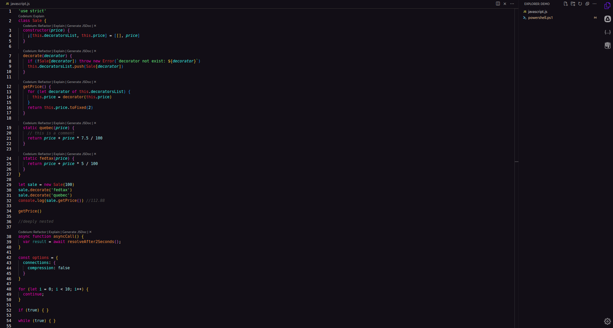

# SuperBrightTheme

SuperBrightTheme is a Visual Studio Code theme inspired by the vibrant and bold color palettes of the renowned game Hotline Miami. This theme provides a unique visual experience, filled with intense colors and striking contrasts to add a stylish touch to your workspace.

## Features

- **Vibrant Colors:** Inspired by the graphic style of Hotline Miami, SuperBrightTheme offers a palette of bold and vibrant colors to make your coding experience more stimulating.

- **Striking Contrasts:** Colors have been carefully chosen to ensure striking contrasts, making code easily readable and understandable.

- **Enhanced Syntax Highlighting:** The theme includes enhanced syntax highlighting for various programming languages, making coding more visually appealing.

- **Readability:** The color combination is designed to provide a comfortable reading experience during extended coding sessions.

## Screenshots

*Image Caption: Example code using the SuperBrightTheme.*

## Contributions

Feel free to contribute by reporting issues, suggesting improvements, or submitting pull requests. Your feedback is always welcome!

## License

This theme is distributed under the MIT license. See the [LICENSE](LICENSE) file for details.

---

Enjoy the SuperBrightTheme! If you have any questions or suggestions, feel free to reach out.